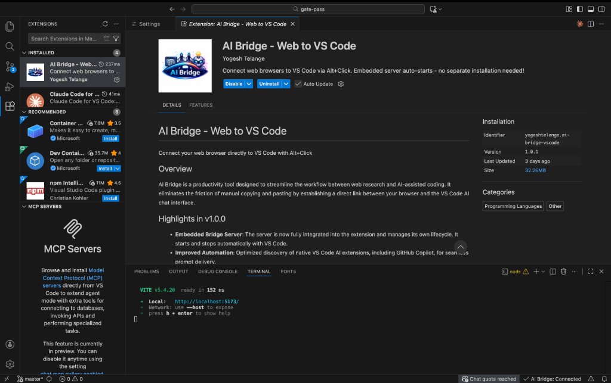
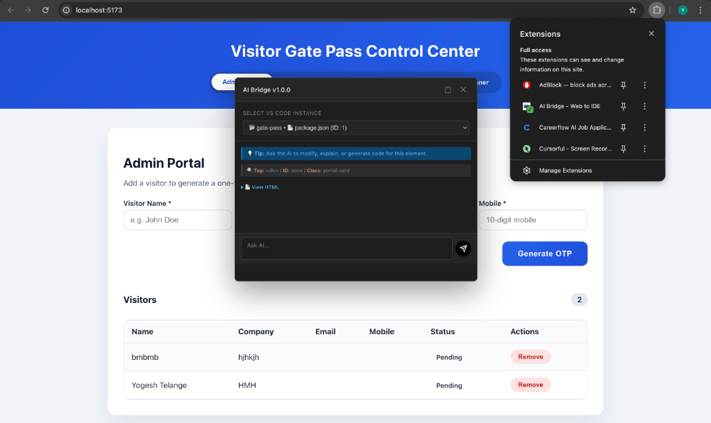

# AI Bridge User Guide

## Overview

AI Bridge enables seamless interaction between your web browser and VS Code IDE. By using Alt+Click on any element in a local development website, you can send context-aware prompts directly to your AI chat interface in VS Code.

## Prerequisites

Before using AI Bridge, ensure you have:

1. **Browser Extension** - AI Bridge installed in your browser (Chrome, Edge, or Firefox)
2. **VS Code Extension** - AI Bridge extension installed in VS Code or compatible IDE
3. **Local Development Site** - Website running on localhost or local network

---

## Installation

### Browser Extension

1. Install the AI Bridge extension from Chrome Web Store:
   - [AI Bridge - Web to IDE on Chrome Web Store](https://chromewebstore.google.com/detail/ai-bridge-web-to-ide/imjmlnfdpcnbehoomepmphchediildkp)
2. The extension icon will appear in your browser toolbar
3. Extension automatically activates on localhost URLs only

### VS Code Extension

1. Install from VS Code Marketplace:
   - [AI Bridge - Web to VS Code](https://marketplace.visualstudio.com/items?itemName=YogeshTelange.ai-bridge-vscode)
2. Or install manually:
   - Open VS Code
   - Navigate to Extensions panel (Ctrl+Shift+X or Cmd+Shift+X)
   - Search for "AI Bridge - Web to VS Code"
   - Click "Install"
3. Reload VS Code when prompted

---

## Verifying Connection Status

### In VS Code

After installing the extension, check the status bar at the bottom of VS Code:



**Connected Status:**
```
AI Bridge: Connected
```
- Green checkmark icon visible
- Status text shows "Connected"
- Click status bar item to reconnect if needed

**Disconnected Status:**
```
AI Bridge: Disconnected
```
- Warning icon visible
- Status text shows "Disconnected"
- Click status bar item to attempt reconnection

**Troubleshooting Connection Issues:**

If status shows "Disconnected":
1. Close all VS Code windows
2. Reopen VS Code
3. Wait 5-10 seconds for auto-connection
4. Check Output panel: View → Output → "AI Bridge: Extension"
5. Look for "WebSocket connection established successfully"

### In Browser

The browser extension indicates connection status through its icon:

**Active (Green):**
- Extension icon shows green indicator
- Ready to send prompts
- Hover over icon to see connection details

**Inactive (Gray):**
- Extension icon shows gray indicator
- Either no VS Code running or not on localhost
- Check that you're on a localhost URL

---

## Using AI Bridge

### Basic Workflow

1. **Open Local Development Site**
   - Navigate to any localhost URL (e.g., `http://localhost:3000`)
   - Extension activates automatically on local URLs only

2. **Select Target VS Code Instance** (if multiple open)
   - When you first Alt+Click, a modal appears if multiple VS Code instances detected
   - Select your desired VS Code instance from dropdown list
   - Selection format: `workspace-name • file.json (ID: 1)`
   - Click outside modal or press Escape to cancel

3. **Alt+Click on Web Element**
   - Hold Alt key (Option on Mac)
   - Click on any webpage element
   - Modal window appears with prompt preview

4. **Review Generated Prompt**
   - Modal shows AI-generated prompt based on element context
   - Preview includes:
     - Element type and purpose analysis
     - Suggested modification prompt
     - Element HTML structure
     - CSS class information

5. **Send to VS Code**
   - Prompt automatically copies to clipboard
   - Extension sends prompt to selected VS Code instance
   - AI chat panel opens automatically in VS Code
   - Prompt appears in chat input ready to send

---

## Multiple VS Code Instances

### Scenario: Multiple VS Code Windows Open

When you have multiple VS Code windows or workspaces open:



1. **First Alt+Click Shows Dropdown**
   ```
   SELECT VS CODE INSTANCE
   
   [Dropdown showing all open instances]
   ▼ gate-pass • package.json (ID: 1)
     ai-bridge-server • extension.js (ID: 2)
     my-project • App.tsx (ID: 3)
   ```

2. **Select Appropriate Instance**
   - Choose based on workspace name
   - ID number shown for reference
   - Currently open file displayed for context

3. **Subsequent Alt+Clicks**
   - Dropdown does not appear again
   - Uses previously selected VS Code instance
   - To change: restart browser or clear extension storage

### Scenario: Single VS Code Instance

When only one VS Code window is open:

1. **No Dropdown Shown**
   - Extension automatically connects to single instance
   - Alt+Click directly shows prompt modal
   - Seamless one-step operation

---

## Understanding the Prompt Modal

When you Alt+Click on an element, the modal displays:

### Modal Header
```
AI Bridge v1.0.1
```

### Prompt Sections

**1. Task Title**
```
Ask the AI to modify, explain, or generate code for this element
```

**2. Element Analysis**
```
Tag: <button>
ID: submit-button
Class: btn btn-primary
```

**3. Suggested Actions**
- Modify this element
- Explain or generate code
- View HTML structure

**4. Quick Actions**
- **View HTML** - Shows complete HTML of element
- **Copy to Clipboard** - Copies prompt without sending
- **Send to AI** - Sends to VS Code and opens chat

---

## Rate Limiting

AI Bridge includes rate limiting to prevent accidental spam:

**Limits:**
- 10 prompts per minute
- Counter resets every 60 seconds

**When Limit Reached:**
```
Rate limit exceeded. Please wait 45 seconds before sending another prompt.
This protects against accidental spam.
```

**Remaining Quota Display:**
```
Prompt sent! (8 requests remaining this minute)
```

---

## Fallback: Manual Copy-Paste Workflow

If automatic prompt delivery fails, use manual workflow:

### When Automatic Delivery Fails

You will see this notification:
```
Prompt copied to clipboard!

To send to AI:
1. Press Cmd+L to open chat (Ctrl+L on Windows)
2. Press Cmd+V to paste (Ctrl+V on Windows)
3. Press Enter to send
```

### Steps to Complete Manually

1. **Verify Clipboard**
   - Prompt is already copied to clipboard
   - No need to manually copy

2. **Open AI Chat**
   - **VS Code with Copilot:** Cmd/Ctrl+Shift+I
   - **Cursor:** Cmd/Ctrl+L
   - **Windsurf:** Cmd/Ctrl+L
   - **Other IDEs:** Check IDE's chat shortcut

3. **Paste Prompt**
   - Press Cmd/Ctrl+V in chat input
   - Prompt appears in chat

4. **Send to AI**
   - Press Enter to send
   - AI processes your request

---

## Supported Environments

### Local Development URLs

AI Bridge works **only** on local development environments for security:

**Supported:**
- `localhost:3000`
- `127.0.0.1:8080`
- `192.168.1.100:5173`
- `dev.myapp.local`
- `local.company.com`
- Docker internal hosts
- Development tunnel URLs (ngrok, etc.)

**Not Supported:**
- Public websites (example.com)
- Production environments
- External APIs
- Third-party sites

**Security:** Extension automatically blocks non-local URLs to prevent data leakage.

### Supported IDEs

- **VS Code** - Full support with GitHub Copilot
- **Cursor** - Full support with keyboard automation
- **Windsurf** - Full support with keyboard automation
- **Antigravity** - Full support
- **Other VS Code Forks** - May work with manual paste

---

## Troubleshooting

### Extension Not Activating

**Problem:** Browser extension icon stays gray

**Solution:**
1. Verify you are on a localhost URL
2. Check URL matches local development patterns
3. Try reloading the webpage
4. Check browser console for errors (F12)

### VS Code Not Receiving Prompts

**Problem:** Prompt not appearing in VS Code

**Solution:**
1. Check VS Code status bar shows "Connected"
2. Verify embedded server is running (Output → AI Bridge: Server)
3. Try clicking the status bar to reconnect
4. Reload VS Code window (Cmd/Ctrl+Shift+P → "Developer: Reload Window")
5. Use manual copy-paste workflow as fallback

### Dropdown Not Appearing

**Problem:** Cannot select VS Code instance

**Solution:**
1. If only one VS Code open, dropdown not needed
2. If multiple open, ensure they are fully loaded
3. Try closing and reopening VS Code instances
4. Clear browser extension storage and retry

### Rate Limit Issues

**Problem:** Hitting rate limits frequently

**Solution:**
1. Wait for the cooldown period (shown in error message)
2. Avoid rapid Alt+Clicking
3. Limit is 10 prompts per minute
4. If legitimate need for more, contact support

---

## Advanced Features

### Context Extraction

AI Bridge automatically extracts:
- Element tag and attributes
- CSS classes and styling
- Surrounding context
- Parent and child elements
- ARIA labels and accessibility info
- Data attributes

### Smart Prompt Generation

Prompts are optimized for AI understanding:
- Structured format with clear sections
- Element hierarchy included
- Context-aware suggestions
- Ready for immediate AI processing

### Keyboard Automation

For compatible IDEs:
1. Automatically opens AI chat panel
2. Pastes prompt into chat input
3. Focuses chat for immediate sending
4. Fully automated workflow

---

## Privacy and Security

### Data Handling

**Local Only:**
- All communication happens on localhost
- No external servers involved
- No data sent to third parties
- Prompts never leave your machine

**Security Measures:**
- URL validation (localhost only)
- Input sanitization
- Rate limiting
- Secure WebSocket connection
- No credential storage

### What Gets Sent

When you Alt+Click:
- Element HTML structure
- CSS classes and attributes
- Generated prompt text
- Current URL (for context only)

**Never Sent:**
- Cookies or authentication tokens
- Full page content
- User credentials
- Browser history

---

## Uninstallation

### Browser Extension

1. Right-click extension icon
2. Select "Remove from Browser"
3. Confirm removal

### VS Code Extension

1. Open Extensions panel (Cmd/Ctrl+Shift+X)
2. Find "AI Bridge - Web to VS Code"
3. Click "Uninstall"
4. Reload VS Code

**Note:** No data cleanup needed - extension stores no persistent data.

---

## Support and Feedback

### Getting Help

1. **Check Output Panel**
   - View → Output
   - Select "AI Bridge: Extension"
   - Look for error messages

2. **Check Browser Console**
   - Press F12
   - Go to Console tab
   - Look for AI Bridge errors

3. **Verify Prerequisites**
   - VS Code extension installed and enabled
   - Browser extension installed and enabled
   - On localhost URL
   - Multiple VS Code instances handled correctly

### Reporting Issues

When reporting issues, include:
- VS Code version
- Browser and version
- Extension versions (both browser and VS Code)
- Steps to reproduce
- Error messages from Output panel
- Browser console errors

---

## Changelog

### Version 1.0.1 (Current)

**New Features:**
- Embedded server (no separate installation)
- Automatic server lifecycle management
- Smart VS Code instance selection
- Rate limiting (10 requests/minute)
- Enhanced local URL detection
- Improved error messages

**Bug Fixes:**
- Fixed connection stability
- Resolved port conflict issues
- Improved clipboard handling

---

## Frequently Asked Questions

**Q: Can I use AI Bridge on production websites?**  
A: No. For security reasons, AI Bridge only works on localhost and local development environments.

**Q: Do I need to manually start a server?**  
A: No. The embedded server starts automatically with VS Code.

**Q: What if I have multiple monitors?**  
A: Works seamlessly. VS Code can be on any monitor.

**Q: Can I customize the keyboard shortcuts?**  
A: Alt+Click is fixed, but AI chat shortcuts vary by IDE and can be customized in IDE settings.

**Q: Does it work with other AI assistants besides Copilot?**  
A: Yes. Works with any AI chat that accepts text input (Cursor, Windsurf, Continue, etc.).

**Q: Why is the extension icon gray?**  
A: You are not on a localhost URL. Extension only activates on local development sites.

---

## Quick Reference

### Common Commands

| Action | Shortcut |
|--------|----------|
| Send element to AI | Alt+Click (Option+Click on Mac) |
| Open AI chat (VS Code) | Cmd/Ctrl+Shift+I |
| Open AI chat (Cursor/Windsurf) | Cmd/Ctrl+L |
| Paste from clipboard | Cmd/Ctrl+V |
| Show extension logs | View → Output → AI Bridge |
| Reconnect extension | Click status bar item |

### Status Indicators

| Indicator | Meaning |
|-----------|---------|
| Green checkmark in browser | Extension active on localhost |
| "AI Bridge: Connected" in VS Code | Server running, WebSocket connected |
| "AI Bridge: Disconnected" | Connection lost, click to reconnect |
| Gray extension icon | Not on localhost URL |

---

## Best Practices

1. **Keep VS Code Open**
   - Extension requires VS Code to be running
   - Server stops when VS Code closes

2. **Use on Localhost Only**
   - Designed for local development
   - Will not activate on public websites

3. **Select Correct VS Code Instance**
   - If multiple projects open, choose relevant workspace
   - Selection persists for session

4. **Monitor Rate Limits**
   - Stay within 10 prompts per minute
   - Wait for cooldown if limit reached

5. **Check Connection Status**
   - Glance at VS Code status bar periodically
   - Reconnect if disconnected

6. **Use Fallback When Needed**
   - Manual paste workflow always works
   - Good backup if automation fails

---

## Conclusion

AI Bridge streamlines the workflow between web development and AI-assisted coding. By eliminating context switching and manual copying, it enables faster development iterations and more efficient use of AI coding assistants.

For additional support or feature requests, refer to the project repository or contact the development team.

**Version:** 1.0.1  
**Last Updated:** January 2026  
**Author:** Yogesh Telange